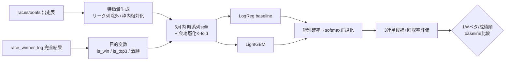

# DOTレーティング step-1-1: データ棚卸し + 初期相関分析 + 設計プラン（phase4 後・実測版）

> 本文書の数値は phase1〜4 完了後の本番 Supabase に対する**読み取り専用クエリの実測値**。
> 取得スクリプト: `scripts/dot/inventory.py` / `scripts/dot/eda_correlation.py`（いずれも SELECT のみ・DB非破壊）。
> 実測日: 2026-06-15。

## 0. 前提

- 既存 `backend/app/prediction/engine.py`（v58.7再現エンジン）には**一切触れない**。DOTは完全独立の新規予想系。
- アプローチは「スクレイピング出走表データ → 実着順」を統計/MLで直接モデル化するデータ駆動。PDF/Claude裁量再現ではない。
- JOIN 仕様: `date + venue + race_no`（= `race_key = YYYYMMDD+venue_code+race_no` と等価。`backend/app/api/races.py:247-251` の参照仕様）。

## 1. データ棚卸し結果（実測）

### 1-1. テーブル在庫

| 対象 | 行数 | ユニーク日数 | 期間 | 会場数 |
|---|---:|---:|---|---:|
| races | **972** | 11 | 2026-05-05 〜 2026-06-14 | 24 |
| boats | **5832** | - | racesに従属（972×6） | - |
| race_winner_log | **2026** | 39 | 2026-05-03 〜 2026-06-13 | 24 |

- 幻レース444件は削除済み。`races` は実在972件のみ。

### 1-2. 出走表完全性（races に対する boats 充足）

| 区分 | 件数 | 比率 |
|---|---:|---:|
| boats=6（完成） | **972** | 100.0% |
| 0<boats<6（中途半端） | 0 | 0% |
| boats=0（幻/未取得） | 0 | 0% |

→ **出走表は完全に健全。全972レースが6艇揃い。**

### 1-3. 確定結果完全性（race_winner_log）

| 指標 | 件数 | 比率 |
|---|---:|---:|
| trifecta_result 非NULL | 2024 / 2026 | 99.9% |
| place2_lane 非NULL | 2024 / 2026 | 99.9% |
| place3_lane 非NULL | 2024 / 2026 | 99.9% |
| 完全結果（1〜3着+三連単） | 2024 / 2026 | 99.9% |
| 結果欠損（非完全） | 2 / 2026 | 0.1% |

→ 残2件は不成立/返還（芦屋06-08 R7・尼崎06-11 R11）で仕様上正しい欠損。**結果データは実質100%完全。**

### 1-4. 【最重要】学習可能サンプル数（出走表 boats=6 × 完全確定結果 INNER JOIN）

| 指標 | 実数 |
|---|---:|
| **学習可能レース数** | **430 レース** |
| **学習可能艇行数** | **2580 行**（=430×6） |
| 律速要因 | 完成出走表 972 / 完全結果 2024 |

- **判定: 学習可能。** phase4 前は join=0 だったが、現状は **430 レース / 2580 艇行** に到達。ロジスティック回帰ベースライン学習に十分な規模。
- **律速は出走表側ではなくカバー期間の不一致**: `races` は 11 日分（5/5〜6/14）しか無いのに対し `race_winner_log` は 39 日分（5/3〜6/13）。`races` 側の日付×会場が少ないため join が 430 に絞られる。→ 学習サンプルを増やすには**出走表(entry)の追加取得**が有効（§4）。

### 1-5. 学習可能レースの会場×月分布（実測）

| 月 | レース数 | 主な会場 |
|---|---:|---|
| 2026-05 | **24** | 平和島のみ |
| 2026-06 | **406** | びわこ60, 丸亀36, 徳山36, 大村36, ほか14会場 |

→ **5月が平和島24レースのみと極端に薄い。** 単純な「5月train→6月valid」時系列分割は5月側が貧弱で不成立。§5で代替分割を採用。

## 2. 利用可能な特徴量（boats列の実確認）

`boats` の実カラム（probe 確認済み）から、**レース前に確定する=リークしない**数値特徴を抽出。

| カテゴリ | 列 | join標本でのカバレッジ |
|---|---|---|
| 枠/属性 | `lane`, `age`, `weight`, `f_count`, `is_local` | 全行（age一部欠） |
| 選手基礎力(全国/当地) | `national_win_rate`, `national_place2_rate`, `national_place3_rate`, `local_win_rate`, `local_place2_rate` | **約72%**（1854/2580） |
| 長期集計(1年/5年) | `general1y_win_rate`, `general1y_place2_rate`, `general1y_tricast_rate`, `local5y_win_rate`, `local5y_place2_rate`, `local5y_tricast_rate` | **22〜37%**（general1y=576, local5y=960） |
| コース別勝率 | `c1_win_rate`〜`c6_win_rate`, `c*_place2_rate`, `c*_tricast_rate` | 約34%（880） |
| スタート | `avg_st`(68%), `today_st`(37%), `course1y_st`(22%), `exhibition_st`, `standard_st` | 中〜低 |
| モーター/機力 | `motor_place2_rate`(72%), `motor_no`, `motor_eval`, `motor_rank_letter` | 中 |
| 展示 | `exhibition_time`(28%) | 低 |
| その他率 | `gen_rate`, `hit_rate` | 全行 |

### 2-1. ⚠️ 全欠損（join標本で 100% NULL）の列

以下は join 標本で**全件 NULL**＝現状そのままでは特徴量に使えない:
`motor_ratio`, `boat_ratio`, `deashi`, `nobashi`, `odds_win`(人気), `season_st`, `start_timing`, `exhibition_1lap`, `exhibition_turning`, `exhibition_straight`, `lap1_time`, `turn_time`。

→ これらを使いたい場合はスクレイパ側の取得/保存を別途見直す必要がある（step-1-1 のスコープ外、§4で言及）。**`odds_win` が全欠損のため「人気順ベースライン」は現状不可。**

## 3. 初期相関分析（実測・430レース/2580艇行）

### 3-1. 特徴量 × is_win / is_top3（point-biserial相関, |is_win|降順 上位）

| 特徴量 | 有効N | corr(is_win) | corr(is_top3) | 所見 |
|---|---:|---:|---:|---|
| general1y_win_rate | 576 | **+0.551** | +0.377 | 最強。ただしN=576と部分カバー |
| local5y_win_rate | 960 | **+0.475** | +0.308 | 強い・カバー良好 |
| general1y_place2_rate | 576 | +0.473 | +0.439 | 強い |
| local5y_place2_rate | 576 | +0.438 | +0.460 | top3に特に効く |
| general1y_tricast_rate | 576 | +0.395 | +0.469 | top3最強級 |
| **lane** | 2580 | **−0.348** | −0.338 | 枠が小さいほど勝つ（競艇常識と一致） |
| local5y_tricast_rate | 960 | +0.329 | +0.404 | |
| c1_win_rate | 880 | +0.226 | +0.343 | 1コース成績 |
| course1y_st | 576 | −0.220 | −0.300 | STは小さいほど良い（符号妥当） |
| national_place2_rate | 1854 | +0.188 | +0.309 | カバー良好 |
| national_win_rate | 1854 | +0.167 | +0.304 | カバー良好 |

### 3-2. 枠別 1着率 / 3着内率（実測・各N=430）

| 枠 | N | 1着率 | 3着内率 |
|---:|---:|---:|---:|
| 1 | 430 | **53.3%** | 78.6% |
| 2 | 430 | 13.0% | 60.0% |
| 3 | 430 | 11.6% | 54.2% |
| 4 | 430 | 11.2% | 45.3% |
| 5 | 430 | 7.2% | 37.0% |
| 6 | 430 | 3.7% | 24.9% |

### 3-3. 初期所見

- **join は正しい**: 1号艇1着率 53.3% は実競艇の全国平均(約55%)とほぼ一致。phase4前のN=72ノイズ（1枠16.7%）から脱却し、**統計的に信頼できる標本になった**。
- **効く特徴が明確**: 選手の長期成績（general1y/local5y の win/place2/tricast rate）が最も強く、次いで `lane`、コース別勝率、ST。**符号も全て競艇の常識と整合**（成績高い=勝つ、枠小=勝つ、ST小=勝つ）。
- **カバレッジが課題**: 最強の `general1y_*` 群は N=576（22%）と欠損が多い。`local5y_*`(37%)、`national_*`(72%) はマシ。→ 欠損補完 or 欠損に強いモデル(LightGBM)が必要。
- **`lane` は全行揃い**で相関も安定。最低限 `lane` + `national_*` + `local5y_*` だけでもベースラインは組める。

## 4. データ不足判定 & 追加スクレイピング

### 4-1. 判定

**判定: ベースライン学習は開始可能（不足ではない）。**

- 学習可能 **430レース / 2580艇行** はロジスティック回帰の艇別 P(win)/P(top3) に十分。
- ただし **時系列検証には課題**（5月=24レースのみ）。検証の頑健性とLightGBM投入のためには **800〜1000レース規模が望ましい**。
- → **着手はするが、並行して出走表(entry)を段階追加してサンプル拡大**を推奨。

### 4-2. 追加スクレイピング方針（ユーザー指示準拠・段階取得）

- 律速は出走表(entry)カバー期間。`race_winner_log` は 39日分あるのに `races` は 11日分しかない → **結果がある日付の出走表を埋めれば join が増える**。
- `scripts/sakura/backfill_phase4.py` のスライス機能を活用し、**全会場一括は禁止・5月分から段階的**に:
  1. `--list-slices --items entry` で会場×月のバッチ数を可視化。
  2. `--dry-run` → `--max-batches 5` で小範囲試行。
  3. **5月分の主要会場から**順次: 例
     `python scripts/sakura/backfill_phase4.py --items entry --venue びわこ --from 2026-05-01 --to 2026-05-31 --all-dates`
  4. 逐次・`sleep≥3s`・指数バックオフ・冪等upsert(on_conflict=race_key) の既存安全策を維持。
- 補助課題（別フェーズ）: §2-1 の全欠損列（特に `odds_win`=人気）はスクレイパ側の取得見直しが必要。人気順ベースライン比較に必要なら別途対応。

## 5. DOTレーティング設計案

### 5-1. 目的変数（段階）

1. 第1段: 各艇 **1着確率 P(win)**（教師=is_win）
2. 第2段: 各艇 **3着内確率 P(top3)**（教師=is_top3）
3. 第3段: 艇別確率 → **3連単候補生成**（P(win)×条件付き2着3着の近似 or Plackett-Luce）

### 5-2. モデル方式

| 段階 | モデル | 役割 |
|---|---|---|
| ベースライン | ロジスティック回帰（艇別 P(win)/P(top3)） | 解釈性・安定。重み付き線形スコア=「DOTレーティング素点」を併設 |
| 本命 | LightGBM（二値 or ランキング目的） | 非線形・相互作用・**欠損に強い**（§3-2のカバレッジ問題に有効） |
| 確率正規化 | 同レース6艇スコアを softmax 正規化（合計1） | 3連単期待値計算の土台 |

- **DOTレーティング** = 各艇スコア（モデル出力 or 線形素点）。レース内で相対化し順位・買い目を生成。
- 特徴は**枠内相対化**（同レース6艇内での z-score/順位）を追加。競艇は絶対値より相対力が効く。

### 5-3. 学習/検証分割

- 5月が薄い（24レース/平和島のみ）ため**単純時系列分割は不可**。代替:
  - **6月内で時系列ホールドアウト**（6月前半train→後半valid）を主とし、5月24件はtrainに合流。
  - 補助で **会場層化K-fold**（会場偏りの汎化確認）。
- リーク防止: 結果確定後の列（winner/place/trifecta/result_all）は特徴量から除外。集計特徴は対象日以前で作成。

### 5-4. 評価指標 & ベースライン

| 観点 | 指標 |
|---|---|
| 確率較正 | LogLoss, AUC |
| 的中 | Top1的中率（1着当て）, Top3的中率, 3連単 Top-k的中率 |
| 収益 | **回収率**（`trifecta_payout` で擬似購入シミュレーション） |
| ベースライン | **①1号艇ベタ（実測1着率53.3%が基準線）**, ②national_win_rate順, （③人気順は `odds_win` 欠損のため現状不可） |

合否: DOTが①②を的中率・回収率で上回るか。

## 6. 次フェーズ実装ロードマップ（step-1-2以降）

1. 学習用データ抽出スクリプト（join→特徴量行列・リーク列除外・枠内相対化）
2. ロジスティック回帰ベースライン（P(win)/P(top3)）＋ 1号ベタ比較
3. LightGBM 比較実験（欠損許容で全特徴投入）
4. 3連単候補生成＋回収率評価レポート
5. （並行）出走表 entry の段階バックフィルでサンプル拡大（§4-2）

## 7. 成果物（step-1-1）

- `scripts/dot/inventory.py` — 在庫/完全性/**学習可能join数(430)**を実数出力（読取専用）
- `scripts/dot/eda_correlation.py` — 特徴量×着順の初期相関・枠別率（読取専用）
- `tmp/dot_inventory.json` / `tmp/dot_eda.json` — 実測JSON
- 本文書（更新）
